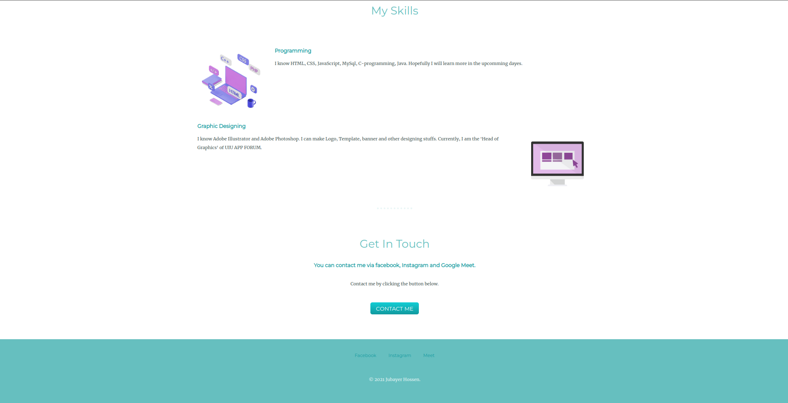

# Simple Calculator With Javascript
## Project Overview
This is a simple web application of a calculator.
## Developed Using
Programing Languages: HTML, CSS, JavaScript
## Developed By
  Jubayer Hossen  
  Email: `jhossen191254@bscse.uiu.ac.bd`  
  BSc in Computer Science and Engineering  
  United International University

## Snapshots

## Features List
* Can calculate all the basic opearations
* All the buttons have clicking sound
## Compatibility 
All devices including: `PC` `Laptop` `Smartphone` `Tablet`
